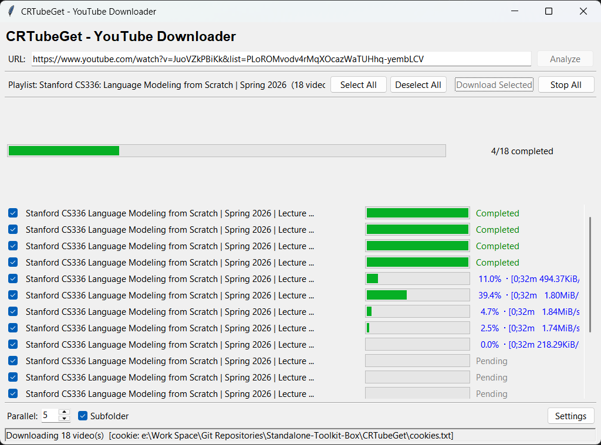
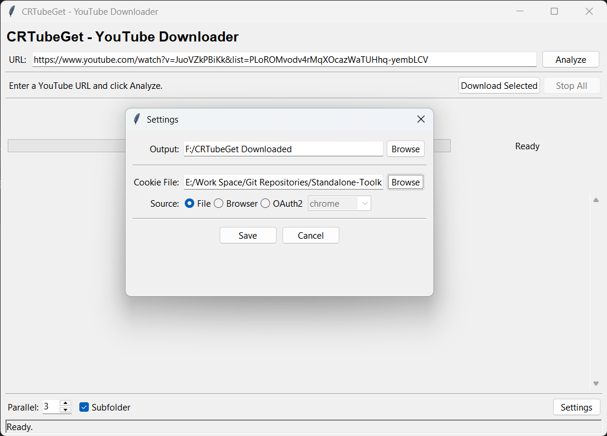

# CRTubeGet — YouTube Video & Playlist Downloader (GUI)

A tkinter-based GUI front-end for [yt-dlp](https://github.com/yt-dlp/yt-dlp) that supports
single video and playlist downloads with parallel processing, real-time progress, and
per-video cancellation.


> **Security:** Never commit `cookies.txt` to version control. It contains your
> YouTube login credentials. This repository includes a `.gitignore` rule for it.

## Features





- **Auto-detect** single video vs playlist from any YouTube URL
- **Playlist confirmation dialog** — choose to download all videos or just the one you opened
- **Selective download** — check/uncheck individual videos in a playlist
- **Parallel downloads** — configurable concurrency (1–8 workers)
- **Real-time progress** — per-video progress bars, speed, ETA, and overall completion
- **Stop All** — cancel all in-progress downloads with one click
- **Subtitles** — auto-downloads English subtitles (manual + auto-generated) in VTT format
- **Cookie sources** — File (cookies.txt), Browser (Chrome/Firefox/Edge/Brave/Opera), or OAuth2
- **High-DPI aware** — crisp rendering on 4K / scaled Windows displays


## Prerequisites

| Tool | Required | Purpose |
|------|----------|---------|
| **Python 3.8+** | Yes | Runtime |
| **deno** | Yes | JavaScript challenge solver for YouTube's n-sig anti-bot protection |
| **ffmpeg** | Yes | Merging video+audio streams into a single MP4 file |

### Why deno?

YouTube serves several different player clients. When cookies are present
(auth required for age-restricted or member-only videos), yt-dlp uses the **web**
player, which triggers an **n challenge** (a JavaScript-based signature).  
yt-dlp bundles a challenge solver, but it needs a JavaScript runtime.  
**deno** is the only runtime enabled by default in yt-dlp ≥ 2026.6.

> Node.js ≥ v22 is **not** currently recognized. If you have trouble with deno,
> see the [EJS wiki](https://github.com/yt-dlp/yt-dlp/wiki/EJS).

---

## Installation (Windows)

### 1. Python

Download and install Python 3.8+ from [python.org](https://www.python.org/downloads/).  
**Check "Add Python to PATH"** during installation.

Verify:
```powershell
python --version
```

### 2. ffmpeg

**Option A — winget (recommended)**
```powershell
winget install Gyan.FFmpeg
```

**Option B — manual download**
1. Go to https://ffmpeg.org/download.html
2. Download the Windows build (e.g., from gyan.dev)
3. Extract to `C:\ffmpeg\`
4. Add `C:\ffmpeg\bin\` to your system PATH

Verify:
```powershell
ffmpeg -version
```

### 3. deno

**Option A — winget (recommended)**
```powershell
winget install DenoLand.Deno
```

**Option B — manual download**
1. Go to https://github.com/denoland/deno/releases/latest
2. Download `deno-x86_64-pc-windows-msvc.zip`
3. Extract and place `deno.exe` in the project folder (next to `CRTubeGet.py`)
   or anywhere on your PATH

Verify:
```powershell
deno --version
```

### 4. Python dependencies

```powershell
pip install -r requirements.txt
```

Or directly:
```powershell
pip install "yt-dlp>=2026.6.9"
```

### 5. YouTube cookies (required for age-restricted / login videos)

YouTube aggressively rate-limits unauthenticated traffic. To download reliably,
you need to provide cookies from a logged-in browser session.

**Option A — Browser extension (easiest, recommended)**

1. Install **"Get cookies.txt LOCALLY"** from the Chrome Web Store
2. Log into YouTube in your browser
3. Click the extension icon → **Export cookies.txt**
4. Save the file as `cookies.txt` in the project folder

**Option B — Browser cookie database**

In CRTubeGet, set **Source → Browser** and choose your browser.  
> **Note:** Chromium browsers (Chrome, Edge, Brave) lock their cookie database
> while running. Close the browser first, or use **Firefox** which has no lock.

**Option C — OAuth2** (deprecated by YouTube, may not work)

---

## Installation (macOS / Linux)

```bash
# macOS
brew install python ffmpeg deno

# Ubuntu / Debian
sudo apt install python3 ffmpeg
# deno: see https://deno.land/#installation

# Arch
sudo pacman -S python ffmpeg deno

# Python deps
pip install -r requirements.txt

# Export cookies (use the Chrome extension or Firefox)
# Place cookies.txt in the project folder
```

---

## Usage

```bash
python CRTubeGet.py
```

### Workflow

1. **Enter a YouTube URL** — video or playlist
2. Click **Analyze**
3. **If playlist** → a dialog asks whether to download the full playlist
   - **Yes**: all videos appear, checked by default; uncheck any you want to skip
   - **No**: only the first video is downloaded immediately
4. **If single video** → download starts immediately
5. Monitor progress in the scrollable list; click **Stop All** to cancel

### Settings

| Setting | Description |
|---------|-------------|
| **Output** | Directory where downloaded videos are saved. Default: `./dataset/` |
| **Cookie** | Path to `cookies.txt` file (Source = File) |
| **Source** | `File` — use cookies.txt / `Browser` — read from browser cookie DB / `OAuth2` — deprecated |
| **Parallel** | Number of simultaneous downloads (1–8). Default: 3 |

---

## Build Standalone Executable (.exe)

Package CRTubeGet into a single double-clickable `.exe` that requires
**no Python installation** on the target machine.

### 1. Install PyInstaller

```powershell
pip install pyinstaller
```

### 2. Run PyInstaller

**Recommended — single-file exe with deno bundled:**
```powershell
pyinstaller `
  --onefile `
  --windowed `
  --name CRTubeGet `
  --add-data "crtubeget;crtubeget" `
  --add-binary "deno.exe;." `
  --collect-all yt_dlp `
  CRTubeGet.py
```

### 3. Include ffmpeg (optional)

To also bundle ffmpeg so the target machine needs nothing:

```powershell
pyinstaller `
  --onefile `
  --windowed `
  --name CRTubeGet `
  --add-data "crtubeget;crtubeget" `
  --add-binary "deno.exe;." `
  --add-binary "C:\ffmpeg\bin\ffmpeg.exe;." `
  --collect-all yt_dlp `
  CRTubeGet.py
```

> Replace `C:\ffmpeg\bin\ffmpeg.exe` with your actual ffmpeg path.

### 4. Distribute

The output is at `dist/CRTubeGet.exe`. Copy it to any Windows machine and
double-click to launch. Users should also place a `cookies.txt` in the same
folder for authenticated downloads.

### PyInstaller flags reference

| Flag | Purpose |
|------|---------|
| `--onefile` | Bundle everything into a single .exe |
| `--windowed` | No console window (GUI only) |
| `--name NAME` | Output filename |
| `--add-data "src;dst"` | Include non-Python files in the bundle |
| `--add-binary "src;dst"` | Include binary executables |
| `--hidden-import MOD` | Force-include a module PyInstaller may miss |
| `--collect-all MOD` | Collect all submodules, data files, and binaries from a package |
| `--icon icon.ico` | Set the .exe icon |

---

## 🏗️ Building a Truly Portable Windows EXE

By default, the `.exe` requires deno and ffmpeg to be installed on the target system. To create a **completely standalone** version that includes everything inside the `.exe`, follow these steps:

### 1. Requirements for Building

You can package this tool into a single `.exe` file that runs on any Windows machine **without** requiring Python, deno, or ffmpeg.

- Download `ffmpeg.exe` (Release Essentials version recommended) from [gyan.dev](https://www.gyan.dev/ffmpeg/builds/).
- Ensure `deno.exe` is placed in the `CRTubeGet/` folder (download from [deno releases](https://github.com/denoland/deno/releases)).
- Ensure your entry point (`CRTubeGet.py`) includes the `sys._MEIPASS` path routing logic to locate bundled binaries at runtime.

### 2. Run the Portable Build Command

From the `CRTubeGet/` directory:

```bash
pyinstaller --noconfirm --clean --onefile --windowed --name "CRTubeGet" --add-data "crtubeget;crtubeget" --add-binary "deno.exe;." --add-binary "ffmpeg.exe;." --add-binary "$env:CONDA_PREFIX\Library\bin\libssl-3-x64.dll;." --add-binary "$env:CONDA_PREFIX\Library\bin\libcrypto-3-x64.dll;." --add-binary "$env:CONDA_PREFIX\Library\bin\tcl86t.dll;." --add-binary "$env:CONDA_PREFIX\Library\bin\tk86t.dll;." --hidden-import yt_dlp --collect-all yt_dlp CRTubeGet.py
```

> The `libssl` / `libcrypto` / `tcl86t` / `tk86t` DLLs are **only needed for conda environments** where the base environment has conflicting versions. Skip them if using a standard Python installation.

- **File Size:** The resulting `.exe` will be around 80–120 MB because it contains the yt-dlp engine, deno runtime, and ffmpeg.
- **Portability:** You can now copy `CRTubeGet.exe` to any Windows computer with zero dependencies, and it will work perfectly.

### 3. The resulting `CRTubeGet.exe` will be found in the `dist/` folder.

---

## Project Structure

```
YouTubeDataIngestor/
├── CRTubeGet.py            # Entry point (thin launcher)
├── crtubeget/              # Application package
│   ├── __init__.py         # Version
│   ├── app.py              # Main GUI application (CRTubeGetApp)
│   ├── downloader.py       # yt-dlp option builders & worker functions
│   ├── models.py           # VideoEntry dataclass
│   ├── utils.py            # Executable detection, path helpers
│   └── widgets.py          # VideoProgressRow tkinter widget
├── Youtube.py              # Original CLI script (for reference)
├── cookies.txt             # YouTube cookies (you provide this)
├── deno.exe                # deno runtime (bundled on Windows)
├── requirements.txt        # Python dependencies
├── README.md               # This file
└── dataset/                # Default output directory (created at runtime)
```

### Architecture overview

```
CRTubeGet.py  ──(launches)──▶  crtubeget/app.py  (CRTubeGetApp)
                                      │
                   ┌──────────────────┼──────────────────┐
                   │                  │                  │
              widgets.py         downloader.py        utils.py
         (VideoProgressRow)   (yt-dlp workers)   (find_executable)
                   │                  │
                   └──────────────────┤
                                 models.py
                               (VideoEntry)
```

- **`app.py`** — Owns the tkinter UI, state, and thread management. All widget
  updates happen on the main thread via `root.after()` polling a `queue.Queue`.
- **`downloader.py`** — Zero tkinter imports. Builds yt-dlp option dicts and runs
  analysis/download in background threads. Communicates with the UI exclusively
  through the message queue.
- **`widgets.py`** — Self-contained `VideoProgressRow` widget (checkbox + title +
  progress bar + status label). Depends only on `models.py`.
- **`models.py`** — Pure-data `VideoEntry` dataclass. No external dependencies.
- **`utils.py`** — `find_executable()` with PATH lookup + hardcoded fallbacks.

---

## Troubleshooting

### "Sign in to confirm you're not a bot"

Your cookies are missing, expired, or invalid.
- Re-export `cookies.txt` from the browser extension
- Make sure you are logged into YouTube in that browser
- If using Browser mode, try switching to **File mode** with an exported cookies.txt

### "Requested format is not available" / "n challenge solving failed"

The JavaScript runtime cannot solve YouTube's n-sig challenge.
- Make sure **deno** is installed and on your PATH (or in the project folder)
- Run `deno --version` to verify
- Node.js ≥ v22 is **not** supported — use deno instead

### "Could not copy Chrome cookie database"

Your Chromium browser is running and has locked its cookie DB.
- Close the browser completely, then retry
- Or switch to **Firefox** (no lock issue)
- Or switch to **File mode** with an exported cookies.txt

### "Login with OAuth is no longer supported"

YouTube deprecated OAuth2 login. Switch **Source** to **File** or **Browser**.

### ffmpeg / deno not found

CRTubeGet auto-detects these tools from:
- System PATH
- Hardcoded fallback paths on Windows (`C:\ffmpeg\bin\`, project folder, etc.)

If detection fails, the status bar will show a warning. Install the missing tool
and restart the application.

---

## Technical Notes

- **Thread model**: `ThreadPoolExecutor` for parallel downloads, `queue.Queue` for
  thread-safe UI updates, `root.after()` polling on the main thread
- **Per-video cancellation**: Each `VideoEntry` carries a `threading.Event` that
  the progress hook checks; raising `DownloadCancelled` terminates the worker
- **yt-dlp video format**: `bestvideo[ext=mp4]+bestaudio[ext=m4a]/best` —
  separately downloads best MP4 video and M4A audio, then merges with ffmpeg
- **Subtitle format**: VTT (WebVTT), widely supported across media players
- **Background workers are tkinter-free**: `downloader.py` has no tkinter imports,
  so worker threads never touch the UI toolkit directly

---

## Contributing / Development

```bash
git clone <repo-url>
cd YouTubeDataIngestor
python -m venv venv
venv\Scripts\activate       # Windows
source venv/bin/activate    # macOS / Linux
pip install -r requirements.txt
python CRTubeGet.py
```

### Before your first commit

1. Make sure `.gitignore` is working — `git status` should NOT show:
   - `cookies.txt`
   - `dataset/`
   - `deno.exe`
   - `__pycache__/` or `*.pyc`
2. Place your own `cookies.txt` (exported from the browser extension) in the
   project root — it will be ignored by Git
3. Download `deno.exe` from https://github.com/denoland/deno/releases and place
   it in the project root (also git-ignored)

## License

[MIT](LICENSE)
