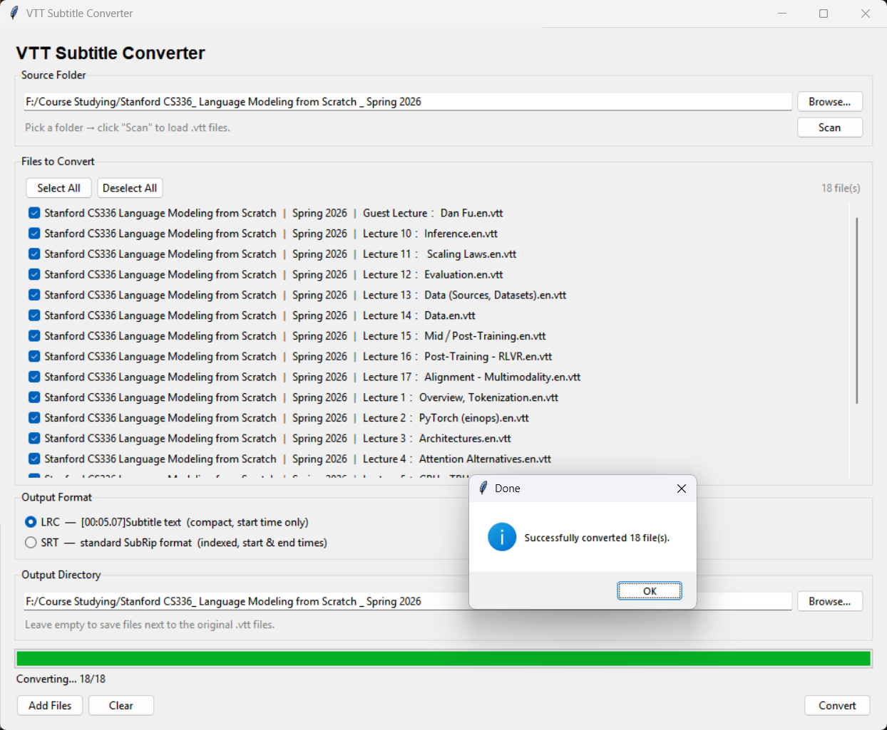

# VTT Subtitle Converter

Convert WebVTT (.vtt) subtitle files to **LRC** or **SRT** format. Pure standard library, zero dependencies.




## Features

- **Dual format output** — LRC (`[MM:SS.ms]Text`) or standard SRT
- **Batch conversion** — scan a folder and pick multiple files at once
- **Dual interface** — CLI for scripting, GUI for point-and-click
- **Selective conversion** — checkbox list per file, Select All / Deselect All
- **Custom output directory** — save converted files anywhere
- **Strips VTT markup** — removes `<b>`, `<i>`, `<c>` inline tags and cue timestamps
- **Zero dependencies** — uses only Python standard library

## Output Formats

| Format | Extension | Example |
|--------|-----------|---------|
| **LRC** | `.lrc` | `[00:05.07]All right, so today's gonna be the second of the basic systems lectures.` |
| **SRT** | `.srt` | `1\n00:00:05,070 --> 00:00:10,420\nAll right, so today's gonna be...` |

## Prerequisites

- Python 3.8+

That's it. No pip install needed.

## Usage

### GUI

```bash
python main_gui.py
```

1. Select a source folder and click **Scan** to load `.vtt` files
2. Check / uncheck files in the list (or use **Select All** / **Deselect All**)
3. Choose your **Output Format** — LRC or SRT
4. Optionally pick an output directory
5. Click **Convert**

### CLI

```bash
# Single file (default: LRC)
python main_cli.py subtitles.vtt

# SRT format
python main_cli.py subtitles.vtt -f srt

# Custom output path
python main_cli.py subtitles.vtt -o output.lrc

# Batch convert
python main_cli.py -b *.vtt -f lrc
```

## License

[MIT](LICENSE)
